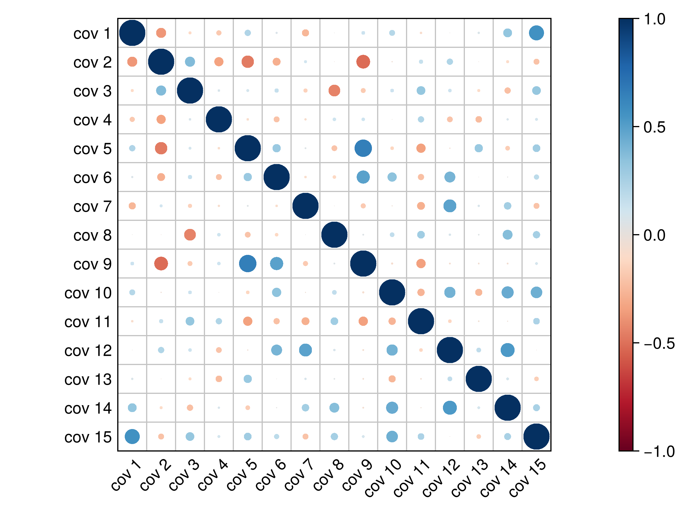

# CorrPlots

## Installation
```julia
julia> ]
(@v1.11) pkg> add https://github.com/mmkim1210/CorrPlots.jl.git
```

## Examples
```julia
using CorrPlots, CairoMakie, Random, Statistics
Random.seed!(134)
n = 15
r = cor(rand(n, n))
begin
    f, ax, p = corrplot(r; diagonal = true, colormap = :RdBu_10, colorrange = (-1, 1))
    ax.aspect = DataAspect()
    ax.xticks = (0.5:(n - 0.5), "cov " .* string.(1:n))
    ax.xticklabelrotation = π / 4
    ax.yticks = (-0.5:-1:-(n - 0.5), "cov " .* string.(1:n))
    hidedecorations!(ax, ticklabels = false)
    Colorbar(f[1, 2], limits = (-1, 1), colormap = :RdBu_10)
    f
end
# save("assets/corr.png", f, px_per_unit = 4)
```
<p align="center"></p>

## References
See [corrplot](https://github.com/taiyun/corrplot)